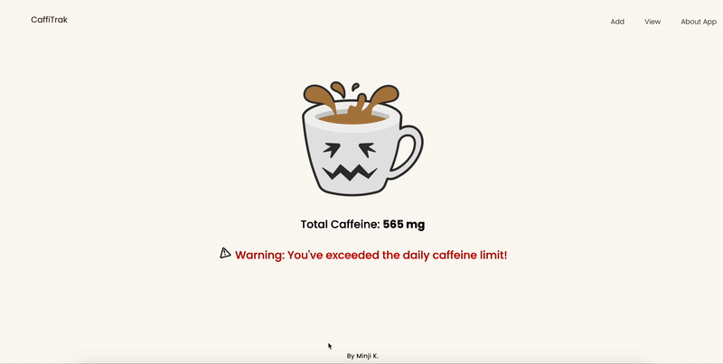
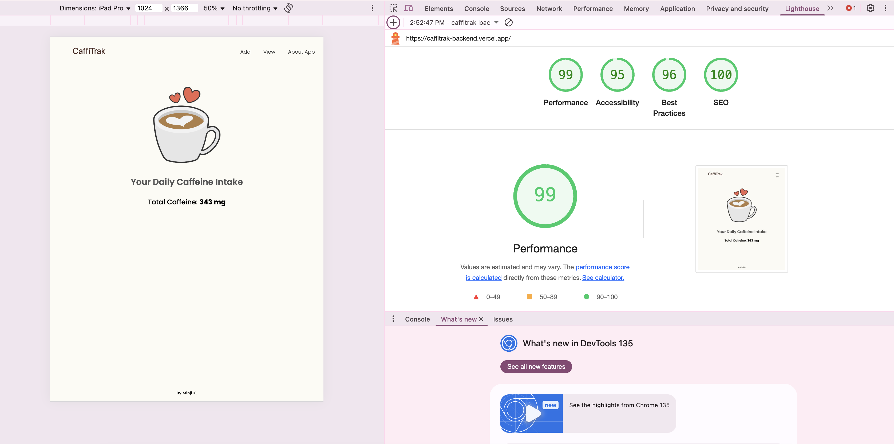

# CaffiTrak

Welcome to **CaffiTrak**,  a light-weighted app for tracking daily caffeine consumption! Whether it's coffee, energy drinks, tea, or any other caffeinated beverage, this app helps you keep track of your daily intake and warns you when you've exceeded the recommended caffeine consumption, helping you maintain a healthy balance. (BUT I LOVE COFFEE STILL)



frontend deployment :https://caffitrak-backend.vercel.app
backend deployment :https://caffitrak-backend.onrender.com

Currently Working On: Combining the frontend and backend into a single deployment 

## Technologies Used

- **Frontend**: React, Styled Components, Framer Motion
- **Backend**: Node.js, Express (for the RESTful API)
- **Database**: MongoDB
- **Development Tools**: Vite (for fast build and HMR), ESLint (for linting)

## Getting Started
Follow these steps to run the project locally:

### Step 1: Clone the repository
```git clone repo-url```

### Step 2: Install frontend dependencies
```npm i```

### Step 3: Install backend dependencies
```cd server```
```npm i```

### Step 4:  Run the backend
```cd server```
```npm run dev```

### Step 5: . Run the frontend
```cd ..```
```npm run dev```

### You’re All Set!
Your frontend will now interact with the backend through the API.


## A11y and SEO
I added ARIA labels, enabled keyboard navigation with visible focus, and used high-contrast colors for accessibility. 
At main page(home) a warning icon complements red text for color-blind users. 
For SEO, I set relevant meta tags and titles to enhance search engine visibility. 
These improvements ensure a more accessible and discoverable app.


## Tracking
I implemented Google Analytics to track user interactions with the app, such as page visits and feature usage, helping improve the user experience. 

Users' caffeine intake data is securely stored in the backend database (MongoDB), and no personal data is shared with third parties, ensuring user privacy is respected.

## Security
CaffiTrak includes some core security measures, with plans to expand them in future iterations:

✅ XSS Protection
XSS risks are currently low because the app only accepts predefined input (dropdowns and selectors).
In future versions, if user-generated text inputs (like custom drink names) are added, we will implement:
Input sanitization
Output encoding
To prevent injection attacks.

🙅🏻‍♀️ Rate Limiting
CaffiTrak uses rate limiting with the express-rate-limit package to restrict requests from a single IP to a set number within 15 minutes. Exceeding the limit results in a 403 Forbidden response, protecting the API from abuse.

🌍 CORS Configuration
The app currently uses an open CORS policy, which allows requests from any origin (for development convenience).
In the future, we plan to restrict CORS to trusted frontend domains to prevent misuse from unknown or malicious origins.

🗑️ Safe Deletion with Confirmation
On the frontend, a confirmation modal appears before deleting a drink, helping users avoid accidental data loss.
On the backend, deletion is handled securely with proper HTTP status codes.

## Http status code
| Status Code      | Description                               |
|------------------|-------------------------------------------|
| `201 Created`    | New drink successfully saved              |
| `200 OK`         | Drink updated or deleted successfully     |
| `400 Bad Request`| Request failed due to invalid data        |
| `404 Not Found`  | Drink with the specified ID not found     |

## API Overview

All API routes follow REST conventions and are scoped to handle **drink entries**.

### ➕ Create a Drink
```http
POST /api/drinks
```

### ➕ Get Today’s Drinks
```http
GET /api/drinks
```

### ➕ Delete a Drink
```http
DELETE /api/drinks/:id
```


